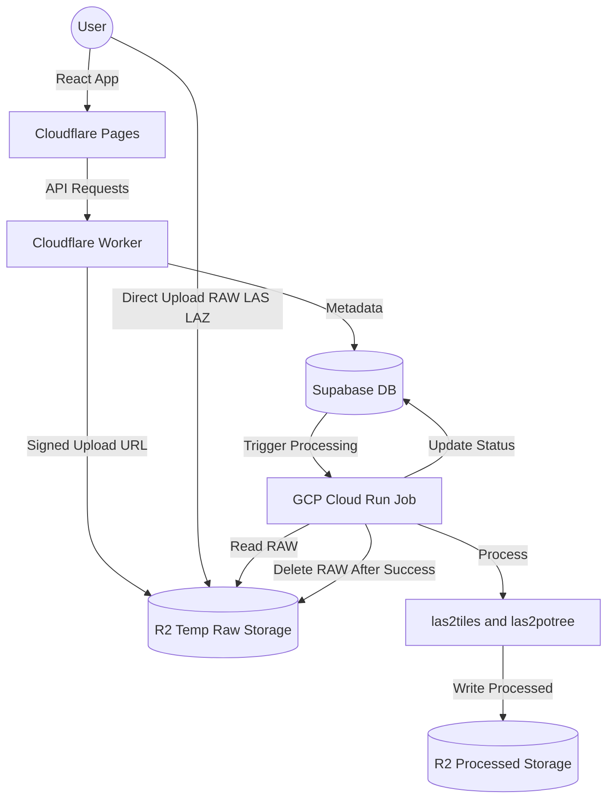

<p align="center">
  
</p>

<h1 align="center">CartaX Geospatial Platform</h1>

<p align="center">
  <strong>Enterprise-Grade 3D Asset Management & Visualization System</strong>
</p>

<p align="center">
  <a href="#features">Features</a> •
  <a href="#tech-stack">Tech Stack</a> •
  <a href="#architecture">Architecture</a> •
  <a href="#quick-start">Quick Start</a> •
  <a href="#deployment">Deployment</a>
</p>

<p align="center">
  
  
  
  
  
  
</p>

---

## 🌍 Overview

**CartaX Geospatial Platform** (formerly GIS-Individual) is a production-grade visualization system designed for high-performance 3D asset management. It enables engineering teams to upload, process, and securely share massive geospatial datasets on an interactive high-fidelity globe.

Built by **FixureLabs**, the platform leverages a hybrid-cloud architecture combining Cloudflare's edge speed with GCP's processing power to deliver seamless 3D experiences.

---

## ✨ Key Features

### 🚀 Point Cloud Processing Pipeline
- **Automated Ingestion**: Direct upload of raw LAS/LAZ files (up to 10GB+).
- **Serverless Conversion**: Triggered GCP Cloud Run Jobs automatically convert raw point clouds into **Potree (Octree)** and **3D Tiles (Cesium)** formats.
- **Hybrid Viewer**: Seamlessly switch between **CesiumJS** (Global Context) and **PotreeViewer** (High-Density Analysis) for optimal performance.

### 🔒 SecureViewer & Enterprise Sharing
- **Secure Links**: Share projects via unique, time-limited URLs.
- **PIN Protection**: Optional 6-digit AES-encrypted PIN access for sensitive data.
- **Read-Only Mode**: External stakeholders can view and measure but cannot alter data.
- **Automated Delivery**: Integration with **Mailgun** for secure link delivery.

### 🛠️ Professional Measurement Tools
- **Precise Metrics**: Distance, Area (m²), Height, and Coordinate analysis.
- **Snap-to-Point**: Intelligent cursor snapping for accurate measurements on 3D models.
- **Layer Visibility**: Toggle measurements and annotations directly from the sidebar.
- **Session Caching**: Measurements are preserved during the session for quick reporting.

### Advanced Layer Management
| Format | Description | Features |
|--------|-------------|----------|
| **3D Tiles** | Massive photogrammetry | Level-of-detail streaming, height adjustment |
| **Potree** | High-density point clouds | Classification visualization, EDL shading |
| **KML/KMZ** | Geospatial vectors | Automatic camera flight, style retention |
| **GLB/GLTF** | 3D Models | Coordinated & uncoordinated placement tools |
| **DXF/SHP** | CAD & GIS data | Client-side parsing and GeoJSON conversion |

---

## 🛠️ Tech Stack

### Client Side
- **React 19** + **TypeScript** + **Vite**: Ultra-fast frontend tooling.
- **CesiumJS + Resium**: Industry-standard 3D globe engine.
- **Potree-Core**: Integrated point cloud renderer for massive datasets.
- **Tailwind CSS**: Modern, responsive engineering UI design.

### Infrastructure & Backend
- **Cloudflare Workers**: Edge API layer for authentication and file operations.
- **Cloudflare R2**: S3-compatible global object storage for assets.
- **Supabase**: PostgreSQL database with Row Level Security (RLS).
- **GCP Cloud Run**: Dockerized conversion pipeline (PDAL, PotreeConverter).

---


---


## 🚀 Quick Start

### Frontend
1. Clone the repository:
   ```bash
   git clone https://github.com/blu7ck/GIS-Individual.git
   cd Hekamap-Workspace-main
   ```
2. Install dependencies:
   ```bash
   npm install
   ```
3. Create `.env` file with your credentials (see `.env.example`).
4. Start development server:
   ```bash
   npm run dev
   ```

### Backend Worker
1. Navigate to backend: `cd backend`
2. Configure `wrangler.toml` with your R2 bucket and Account ID.
3. Deploy to Cloudflare:
   ```bash
   npm install
   npx wrangler deploy
   ```

### Processing Pipeline
Refer to [backend/pointcloud-converter/SETUP.md](backend/pointcloud-converter/SETUP.md) for Docker build and GCP Cloud Run Job deployment instructions.

---

## 🚢 License

Proprietary software developed by **FixureLabs**.  
For licensing inquiries and support, contact: [furkan@fixurelabs.dev](mailto:furkan@fixurelabs.dev)

<p align="center">
  <br>
  <strong>POWERED BY FIXURELABS</strong>
</p>
