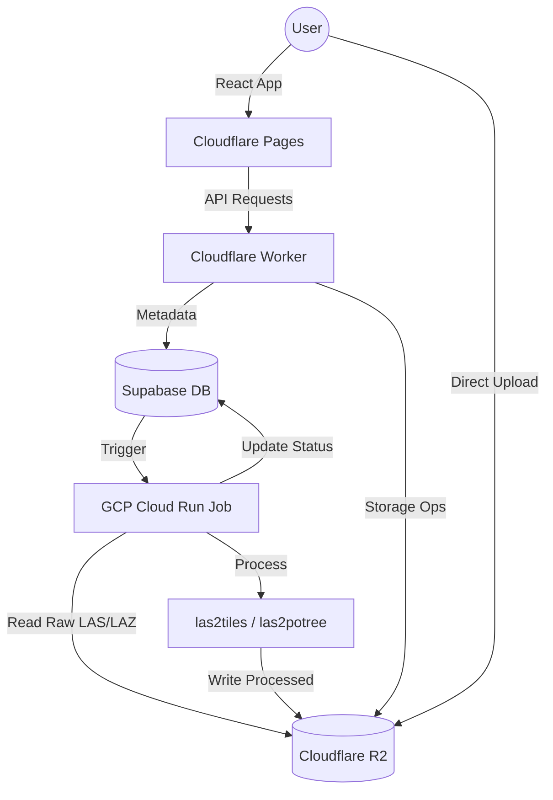

<p align="center">
  
</p>

<h1 align="center">GIS-Individual Project</h1>

<p align="center">
  <strong>Professional 3D Geospatial Asset Management & Processing Platform</strong>
</p>

<p align="center">
  <a href="#features">Features</a> •
  <a href="#tech-stack">Tech Stack</a> •
  <a href="#architecture">Architecture</a> •
  <a href="#quick-start">Quick Start</a> •
  <a href="#deployment">Deployment</a>
</p>

<p align="center">
  
  
  
  
  
</p>

---

## 🌍 Overview

**GIS-Individual Project** is a production-grade geospatial visualization platform designed for high-performance 3D asset management. It enables professionals to upload, automate the processing of massive point clouds, and securely share 3D datasets on an interactive high-fidelity globe.

Built by **FixureLabs**, the platform leverages a hybrid-cloud architecture combining Cloudflare's edge speed with GCP's processing power.

---

## ✨ Key Features

### 🚀 Point Cloud Pipeline (LAS/LAZ)
- **Automated Processing**: Direct upload of raw LAS/LAZ files.
- **Serverless Scaling**: Triggered GCP Cloud Run Jobs process files into **Potree** and **3D Tiles** formats.
- **Dual Viewer**: Switch between CesiumJS (3D Tiles) and a dedicated Potree Viewer for high-density analysis.

### 📁 Advanced Multi-Format Support
| Format | Description | Features |
|--------|-------------|----------|
| **3D Tiles** | Massive photogrammetry | Level-of-detail streaming, height adjustment |
| **Potree** | High-density point clouds | Measurement, classification visualization |
| **KML/KMZ** | Geospatial vectors | Automatic camera flight, style retention |
| **GLB/GLTF** | 3D Models | Coordinated & uncoordinated placement |
| **DXF/SHP** | CAD & GIS data | Client-side parsing and rendering |

### 📊 Project & Data Management
- **Hierarchical Folders**: Organize assets by project and site.
- **Automatic Storage Cleanup**: Smart R2 deletion logic handles folder-based assets (3D Tiles/Potree) and processed outputs.
- **Storage Metrics**: Real-time visual tracking of R2 bucket usage.

### 🔒 Enterprise Sharing
- **PIN Protection**: 6-digit AES-encrypted access for public links.
- **Email Delivery**: Automated notifications via Mailgun.
- **Read-Only Access**: Securely share projects while maintaining data integrity.

---

## 🛠️ Tech Stack

### Client Side
- **React 19** + **TypeScript** + **Vite**
- **CesiumJS + Resium**: High-performance 3D engine.
- **Tailwind CSS**: Modern, responsive engineering UI.
- **Lucide React**: Vector icons.

### Infrastructure & Processing
- **Cloudflare Workers**: Edge API layer and S3-compatible logic.
- **Cloudflare R2**: Global object storage for assets.
- **Supabase**: PostgreSQL, Authentication, and Real-time updates.
- **GCP Cloud Run**: Docker-based processing pipeline for point cloud conversion.
- **Mailgun**: Transactional email infrastructure.

---

## 🏗️ Architecture



---

## 📦 Project Structure

```
.
├── src/                    # Frontend source (React)
│   ├── features/           # Specialized features (PotreeViewer, etc.)
│   ├── components/         # Reusable engineering UI components
│   ├── services/           # Storage, API, and Measurement logic
│   └── hooks/              # Custom React hooks for global state
├── backend/
│   ├── worker.js           # Cloudflare Worker script
│   └── pointcloud-converter/ # GCP Pipeline (Docker, Python, laszip)
├── supabase/
│   └── migrations/         # SQL schema and RLS policies
└── public/                 # Static assets
```

---

## 🚀 Quick Start

### Frontend
1. Clone the repo and install dependencies: `npm install`
2. Configure `.env` with your Supabase and Worker URLs.
3. Start dev server: `npm run dev`

### Backend Worker
1. `cd backend && npm install`
2. Configure `wrangler.toml` with your R2 bucket and Account ID.
3. Deploy: `wrangler deploy`

### Processing Pipeline
Refer to [backend/pointcloud-converter/SETUP.md](backend/pointcloud-converter/SETUP.md) for Docker build and GCP Cloud Run Job deployment.

---

## 🚢 License

Proprietary software developed by **FixureLabs**.  
Contact: [contact@fixurelabs.com](mailto:furkan@fixurelabs.dev)

<p align="center">
  <strong>POWERED BY FIXURELABS</strong>
</p>
